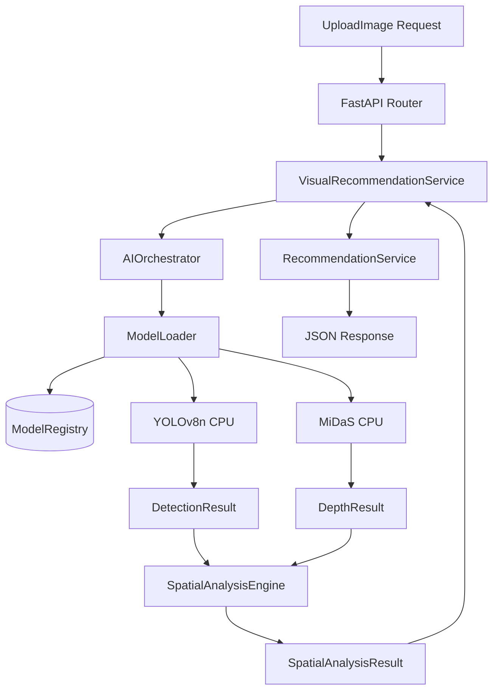

# AI_MODEL_IMPLEMENTATION_AUDIT.md

==================================================
PROJECT CONTEXT
==================================================
LIMATA is a furniture e-commerce system with AI-assisted environmental understanding. This document provides a complete, factual, and read-only technical audit of the current AI/model-related implementation found in the repository as of the audit date.

==================================================
SECTION 1 — EXECUTIVE SUMMARY
==================================================

The LIMATA repository contains an actively scaffolded and functional AI microservice (`apps/ai-service`) that executes Python-based inference for object detection and depth estimation. The system relies entirely on off-the-shelf, pretrained models. While the orchestration, spatial analysis, and chatbot integrations are fully functional, there is no evidence of custom model fine-tuning or proprietary datasets.

| Component | Model/Technology | Purpose | Pretrained? | Custom Trained? | Inference Implemented? | Evaluation Present? | Status |
|------------|------------------|---------|-------------|-----------------|------------------------|---------------------|--------|
| Object Detection | YOLOv8 Nano (`yolov8n.pt`) | Detects furniture/context | Yes (COCO) | No | Yes | Yes | Working |
| Depth Estimation | MiDaS v2.1 Small | Monocular depth mapping | Yes | No | Yes | Yes | Working |
| Spatial Analysis | Deterministic Heuristics | Geometric fusion & placement | N/A | N/A | Yes | Yes | Working |
| Recommendation | Rule-based mapping | Suggests relevant products | N/A | N/A | Yes | No | Working |
| Chatbot Assistant | Gemini API | Natural language interactions | N/A | N/A (API) | Yes | No | Working |

==================================================
SECTION 2 — YOLOv8 IMPLEMENTATION
==================================================

**1. Exact model filename:** `yolov8n.pt`
**2. Exact model path:** `models/yolo/yolov8n.pt`
**3. How the model is loaded:** Using the Ultralytics library (`YOLO(metadata.weights_path)`).
**4. Which Python module/class loads it:** `ModelLoader.load_model()` in `apps/ai-service/app/ml/model_loader.py`.
**5. Which endpoint/service calls it:** `AIOrchestrator._detect_objects()` called by `DetectionService.detect()` (`apps/ai-service/app/services/detection_service.py`).
**6. Input format:** NumPy array derived from decoded image bytes (`cv2.imdecode(np_arr, cv2.IMREAD_COLOR)`).
**7. Image preprocessing:** Minimal; the raw BGR image is passed directly to the `model()` callable.
**8. Inference method:** `model(image)` executed in `AIOrchestrator._detect_objects()`.
**9. Confidence threshold:** Handled internally by Ultralytics defaults; parsed explicitly in `convert_yolo_results`.
**10. IoU threshold:** Using Ultralytics defaults.
**11. Classes being detected:** Pretrained COCO classes (e.g., `couch`, `tv`, `bed`, `dining table`).
**12. Whether COCO classes are being used:** Yes.
**13. Whether custom classes exist:** No.
**14. Output format:** Converted into a LIMATA-native `DetectionResult` DTO.
**15. Bounding box format:** `[x1, y1, x2, y2]` extracted from `box.xyxy[0].tolist()`.
**16. Confidence score handling:** Extracted as float from `box.conf[0]` (`apps/ai-service/app/ml/converters.py`).
**17. Converted to domain objects?** Yes, raw tensors are mapped to `DetectedObject` instances via `convert_yolo_results()`.
**18. Error handling:** Errors update the `ModelState` to `FAILED` and raise a `ModelLoadException` or `AIInferenceException`.
**19. Model loading lifecycle:** Loaded lazily on first request via `ModelLoader.get_model()`.
**20. Model registry/loader involved:** Yes, `ModelRegistry` manages metadata and `ModelLoader` executes loading.
**21. GPU/CPU selection:** Implicit default (CPU likely unless CUDA is explicitly configured).
**22. Model caching:** Yes, cached in memory via `_loaded_models` dict in `ModelLoader`.
**23. Concurrency handling:** Yes, thread-safe lazy loading using `threading.Lock()` per model.

==================================================
SECTION 3 — YOLOv8 TRAINING / FINE-TUNING AUDIT
==================================================

**Classification:** NO EVIDENCE

The repository contains no verified evidence that YOLOv8 has been custom-trained or fine-tuned.
Despite mentions in the `LIMATA_Project_Spec.md`, the repository lacks:
- Datasets, annotations, or `.yaml` data configurations (e.g., `data.yaml`).
- Training scripts, notebooks (`.ipynb`), or Colab integrations.
- Custom-trained weights (`best.pt`, `last.pt`).
- Validation results, confusion matrices, or mAP metrics derived from training.

==================================================
SECTION 4 — YOLOv8 MODEL SOURCE
==================================================

**Source:** PRETRAINED MODEL

The `yolov8n.pt` model is an Ultralytics pretrained checkpoint. It is downloaded automatically by running `python scripts/utilities/download_yolo.py`. The checkpoint is stored locally in the `models/yolo` directory after execution. It is a standard COCO-trained YOLOv8 Nano model, not a furniture-specific fine-tuned model.

==================================================
SECTION 5 — MiDaS IMPLEMENTATION
==================================================

**1. Exact model/checkpoint:** `MiDaS_small` (`midas_v21_small_256.pt`)
**2. Model source:** Downloaded via PyTorch Hub (`torch.hub.load("intel-isl/MiDaS:master", "MiDaS_small")`).
**3. Model loading:** Loaded dynamically in `ModelLoader.load_model()`.
**4. Preprocessing:** Transformed using `midas_transforms.small_transform`.
**5. Input image:** OpenCV NumPy array.
**6. Inference:** Executed in `AIOrchestrator._estimate_depth()` via `prediction = model(input_batch)`.
**7. Output depth map:** `torch.nn.functional.interpolate()` is used to resize the prediction back to the original image dimensions.
**8. Normalization:** Done inside the MiDaS transform.
**9. Resizing:** Bicubic interpolation back to original shape (`height, width`).
**10. CPU/GPU handling:** Explicitly forced to CPU in `_estimate_depth()` (`device = torch.device("cpu")`).
**11. Post-processing:** Tensor moved to CPU and converted to NumPy array in `convert_midas_results()`.
**12. Depth interpretation:** Values represent disparity (inverse depth).
**13. Relative vs Metric:** The implementation provides RELATIVE DEPTH.
**14. Reaching spatial analysis:** The output is wrapped in a `DepthResult` and passed to `SpatialAnalysisEngine`.
**15. Error handling:** Try-except blocks raise `AIInferenceException`.
**16. Lifecycle:** Cached by `ModelLoader` via `_loaded_models`.
**17. Evaluation metrics:** Baseline runtime evaluation exists in `evaluation/results/baseline_report.md`.

==================================================
SECTION 6 — AI MODEL LIFECYCLE
==================================================

The architecture is fully implemented and functioning.

**Lifecycle Flow:**
Application starts → `ModelRegistry` initializes metadata → Request arrives → `ModelLoader.get_model()` intercepts → Checks memory cache (`_loaded_models`) → If absent, updates `RuntimeStatus` to `LOADING` → Acquires `threading.Lock()` → Instantiates model (`YOLO` or `torch.hub`) → Updates state to `READY` → Performs inference → Returns output.

Files implementing this: 
- `apps/ai-service/app/ml/model_loader.py`
- `apps/ai-service/app/ml/registry.py`

==================================================
SECTION 7 — AI PIPELINE / ORCHESTRATOR
==================================================

An orchestrator actively routes inputs through the models.

**Execution Flow (`AIOrchestrator.analyze_spatial_layout`):**
Image Input → `_detect_objects()` (YOLO) → `_estimate_depth()` (MiDaS) → `SpatialAnalysisEngine.analyze()` (Combines bounding boxes with depth maps) → Returns `SpatialAnalysisResult`.

File implementing this: `apps/ai-service/app/ml/ai_orchestrator.py`

==================================================
SECTION 8 — SPATIAL ANALYSIS
==================================================

The system implements a deterministic, heuristics-based spatial engine.

**1. Inputs received:** `DetectionResult` (YOLO) and `DepthResult` (MiDaS).
**2. YOLO contribution:** Bounding boxes specifying where objects are located.
**3. MiDaS contribution:** A relative depth map assigning a disparity value to every pixel.
**4. Calculations performed:** `associate_depth()` extracts depth values enclosed by bounding boxes. `calculate_scene_statistics()` evaluates congestion based on object counts. `evaluate_placement_region()` assesses clearance.
**5. Outputs generated:** `SpatialAnalysisResult` containing ordered distances, nearest/furthest objects, and congestion indices.
**6. Hard-coded thresholds:** Yes, heuristics are applied (e.g., congestion > 0.7 implies "Limited" space).
**7. Logic Type:** Rule-based/deterministic fusion of AI outputs. No downstream ML models interpret the fused data.
**8. Affects recommendations:** Yes, space availability strings ("Limited", "Generous") are passed into context.

File implementing this: `apps/ai-service/app/ml/spatial/engine.py`

==================================================
SECTION 9 — RECOMMENDATION SYSTEM
==================================================

The recommendation system maps detected YOLO classes to domain categories (e.g., "couch" maps to "Living Room" and queries "tv stand table"). 

This mapped context, along with a calculated "space availability" constraint ("Limited", "Moderate", "Generous"), is sent to a deterministic, rule-based `RecommendationService` (`app/services/recommendation_service.py`). 

**Conclusion:** The recommendation engine itself is rule-based, not ML-based, although it consumes inputs generated by ML models.

File implementing this: `apps/ai-service/app/services/visual_recommendation_service.py`

==================================================
SECTION 10 — CHATBOT
==================================================

**Classification:** IMPLEMENTED

The chatbot functionality is actively implemented using the Google Gemini API. 
- The `ChatbotService` integrates with `GeminiClient`.
- It heavily consumes AI pipeline outputs via an `AIContext` object containing spatial analysis results.
- The system prompt enforces strict rules (e.g., "Use the provided AIContext to answer questions about the user's room... Do not invent objects").

File implementing this: `apps/ai-service/app/services/chatbot_service.py`

==================================================
SECTION 11 — API REQUEST FLOW
==================================================

**Flow for Visual Recommendation:**
1. Frontend captures image → `apps/web/src/features/ai/components/camera-capture.tsx`
2. Express Route → `POST /api/ai/visual-recommend` (Forwarding Proxy)
3. FastAPI Route → `POST /api/v1/recommend/visual` (`apps/ai-service/app/api/router.py`)
4. AI Service → `VisualRecommendationService.evaluate()` (`apps/ai-service/app/services/visual_recommendation_service.py`)
5. Orchestrator → `AIOrchestrator.analyze_spatial_layout()`
6. Models → `ModelLoader.get_model()` → YOLO & MiDaS
7. Result → Returns JSON to Express → Frontend.

==================================================
SECTION 12 — ACTUAL AI OUTPUT
==================================================

Actual inference examples are stored in `evaluation/results/baseline_report.md`.
The report contains a table documenting the execution of 15 local images (`01_living_sofa.jpg`, etc.).

**Example Logged YOLO Output:**
- Class: `couch`
- Confidence: `0.87`
- Mapped Context: `Living Room`

**Example Logged Spatial Output:**
- Heuristic: `Suitable`
- Warning: `OBSTACLE_PROXIMITY` (triggered by depth scalars on foreground objects).

==================================================
SECTION 13 — ACCURACY / EVALUATION AUDIT
==================================================

**LIMATA's Own Measured Performance:**
The repository contains a qualitative engineering evaluation (`baseline_report.md`), but NO quantitative scientific metrics (mAP, Precision, Recall, RMSE).

The baseline report states:
- "YOLO Detection Success Rate: 12/15 (80%)"
- "YOLO False Positive Rate: 1/15 (6.6%)"

*No LIMATA-specific statistical model accuracy (e.g., mAP50) has been established in the repository.* Proper YOLO evaluation would require an annotated testing dataset (ground truth bounding boxes) run through `model.val()`, which does not exist here.

==================================================
SECTION 14 — MODEL FILE INVENTORY
==================================================

| File | Type | Purpose | Source | Size | Used by | Status |
|------|------|---------|--------|------|---------|--------|
| `yolov8n.pt` | PyTorch Weights | Object Detection | Ultralytics Release | ~6.5MB | `AIOrchestrator` | Active |
| `midas_v21_small_256.pt` | PyTorch Weights | Depth Estimation | intel-isl Release | ~85MB | `AIOrchestrator` | Active |
| `download_yolo.py` | Python Script | Model acquisition | Manual | N/A | Local Dev | Functional |
| `download_midas.py`| Python Script | Model acquisition | Manual | N/A | Local Dev | Functional |

==================================================
SECTION 15 — DEPENDENCIES
==================================================

- **ultralytics**: Used for the YOLOv8 object detection runtime.
- **torch**: Core deep learning framework; used to execute MiDaS and manage tensors.
- **torchvision**: Dependency for PyTorch and MiDaS transforms.
- **opencv-python-headless (`cv2`)**: Used for decoding multipart HTTP image payloads into NumPy arrays.
- **numpy**: Used for tensor-to-array conversions and spatial calculations.
- **fastapi**: Microservice API framework housing the AI models.

==================================================
SECTION 16 — CURRENT IMPLEMENTATION DIAGRAM
==================================================

