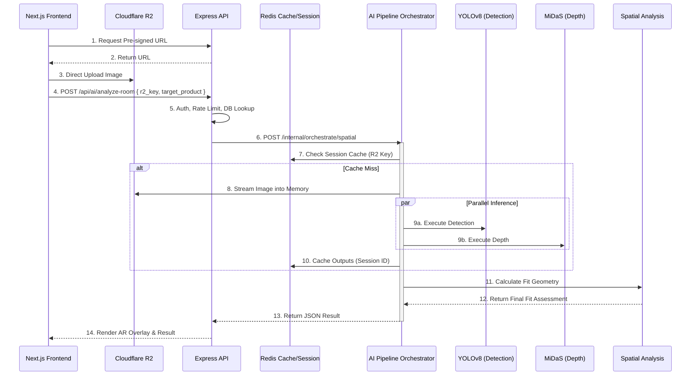

# LIMATA AI System Architecture & Engineering Specification

This document defines the production-ready AI architecture and processing pipeline for the LIMATA platform. It serves as the definitive engineering blueprint for implementing the AI subsystem, focusing on modularity, maintainability, scalability, observability, and resilience.

---

## 1. High-Level AI Architecture

The LIMATA AI ecosystem utilizes a hybrid, event-driven microservice architecture, decoupling compute-heavy machine learning workloads from standard transactional web requests. 

- **Next.js Frontend**: Client-side application handling user inputs, AR rendering (React Three Fiber), and dynamic AI responses.
- **Express API (Gateway)**: The primary backend orchestrator. Handles authentication, authorization, rate-limiting, and proxying requests.
- **FastAPI AI Service**: An isolated, pure ML microservice running PyTorch/Ultralytics models.
- **AI Pipeline Orchestrator**: A specialized module within the FastAPI service responsible for centrally coordinating the execution graph of models, ensuring models never depend directly on each other.
- **Redis (Cache & Session Store)**: Manages Room Analysis Sessions, short-term inference caching, and queue state.
- **PostgreSQL**: Stores persistent application state, chat history, and product metadata.
- **Cloudflare R2**: Object storage for persisting user-uploaded images and 3D assets (`.glb`).

---

## 2. AI Pipeline Orchestration

To achieve true separation of concerns, the AI Pipeline Orchestrator centrally manages the execution flow. Individual AI models (e.g., Detection, Depth) operate as pure functions that receive tensors/images and return raw predictions. They have no knowledge of each other or the downstream consumer.

- **Centralized Coordination**: The Orchestrator receives the initial request and determines the execution DAG (Directed Acyclic Graph).
- **Parallel Execution**: Independent models (YOLOv8 and MiDaS) are triggered asynchronously (`asyncio.gather`).
- **Aggregation**: Once parallel tasks complete, the Orchestrator passes the aggregated results to the Spatial Analysis module.
- **Decoupled Responses**: The Orchestrator formats the final output and returns it to the Gateway, handling partial failures along the pipeline.

---

## 3. Service Independence

AI services within LIMATA are independent consumers of data rather than mandatory, monolithic pipeline stages. 

- **Computer Vision Pipeline (Detection & Depth)**: Dedicated strictly to analyzing pixels and spatial geometry.
- **Recommendation Engine**: Operates independently. It can be invoked via product pages (using product metadata), wishlists, or optionally consume the output of a Room Analysis Session to filter by detected style (e.g., "minimalist room").
- **Conversational Chatbot**: Functions as a standalone service. It can ingest plain text, or be contextually enriched with active product data or room analysis metadata, but is never tightly coupled to the CV pipeline.

---

## 4. Room Analysis Sessions

Users frequently test multiple furniture items within the same uploaded room photo. Re-running YOLOv8 and MiDaS for every request is highly inefficient. 

**Session Architecture:**
- **Session Creation**: When a room image is first analyzed, the Orchestrator generates a unique `Session ID` (linked to the image hash or R2 object key) and stores the extracted 2D bounding boxes and depth matrices in **Redis**.
- **Session Reuse**: Subsequent requests to test a new product in the same room include the `Session ID`. The Orchestrator bypasses the ML models, retrieves the cached spatial geometry from Redis, and routes directly to the Spatial Analysis module.
- **Lifecycle & Expiration**: Sessions are ephemeral. Redis keys are configured with a TTL (e.g., 1 hour), ensuring memory is freed when the user concludes their shopping session.

---

## 5. AI Caching Strategy

Beyond session-based caching, generalized AI inference caching is introduced to optimize performance and reduce compute costs.

- **Cache Keys**: `<Model_Version>:<Image_Hash>` (e.g., `yolov8_v2:a1b2c3d4...`).
- **Storage Location**: Redis for fast, in-memory retrieval.
- **Performance Benefits**: Drastically reduces latency for repeatedly uploaded common images or shared spaces.
- **Invalidation**: Explicit cache invalidation is unnecessary; items naturally expire via TTL (e.g., 24 hours). Updating a model version inherently changes the prefix, automatically bypassing old cache entries.

---

## 6. Image Lifecycle

**Recommendation: Pre-signed URLs with Streaming**
Relying on Express to buffer 10MB images in RAM creates a significant vulnerability for Out-Of-Memory (OOM) crashes under load.

- **Upload Strategy**: The Next.js frontend requests a short-lived **Pre-signed Upload URL** from the Express Gateway. The frontend uploads the image directly to Cloudflare R2, bypassing Express memory entirely.
- **Backend Trigger**: Once uploaded, the frontend sends the R2 object key (or URL) to Express.
- **Inference Streaming**: Express passes the URL to FastAPI. FastAPI streams the image directly into memory (using `requests` or `httpx` stream) for inference, eliminating temporary disk storage and reducing latency.
- **Privacy & Cleanup**: R2 buckets can be configured with lifecycle policies to auto-delete temporary upload artifacts after 7 days, ensuring data privacy and storage optimization.

---

## 7. Model Lifecycle Management

FastAPI manages the complete lifecycle of heavy `.pt` and `.onnx` models to ensure high availability.

- **Registration & Loading**: Managed via a `ModelRegistry` instantiated during the FastAPI `@app.lifespan` event.
- **Warm-up Phase**: Upon loading, the registry passes a dummy tensor through the models. This forces PyTorch to allocate GPU memory and compile CUDA kernels, preventing a latency spike on the first user request.
- **Versioning**: Models are tagged with versions (e.g., `midas_v3.1`). The registry supports seamless A/B testing or rolling updates.
- **Memory Management & Future Scaling**: The loader detects hardware (`cuda`, `mps`, `cpu`). Future iterations will support dynamic unloading (LRU) if GPU memory becomes constrained when hosting multiple large models.

---

## 8. API Design

API exposure is strictly tiered to enforce security and encapsulation.

**Public APIs (Exposed via Express Gateway):**
- `POST /api/ai/analyze-room` (High-level spatial suitability)
- `POST /api/ai/recommend` (Business-level recommendations)
- `POST /api/ai/chat` (Conversational interface)

**Internal APIs (Exposed by FastAPI, Protected in VPC):**
- `POST /internal/orchestrate/spatial` (Aggregates detection & depth)
- `POST /internal/models/detect` (Used strictly for testing/debugging, not invoked by Gateway)
- `POST /internal/models/depth` (Testing/debugging)

**Rationale**: The Gateway should only invoke high-level orchestrator endpoints. Exposing low-level `/detect` externally leaks implementation details and allows abuse of expensive GPU compute.

---

## 9. Failure Recovery

Graceful degradation is critical for preserving user experience during ML failures.

- **Inference Failures**: If YOLO or MiDaS fails (e.g., unreadable image, CUDA OOM), the orchestrator catches the exception and returns a structured error. Express maps this to a user-friendly UI prompt ("We couldn't analyze this room. Please try another photo.").
- **Timeouts**: If FastAPI exceeds the 8-second threshold, Express aborts the request, triggering a circuit breaker to prevent cascading failures.
- **Degraded Recommendations**: If the Recommendation Engine is unreachable, Express falls back to a deterministic PostgreSQL query (e.g., "Top Sellers in this Category").
- **Chatbot Failures**: The Chatbot gracefully replies with a canned fallback response rather than breaking the UI.

---

## 10. Performance Review

To support high concurrency and minimize latency:

- **Batching**: Future GPU worker nodes will implement dynamic batching (grouping requests over a 50ms window) to maximize GPU throughput.
- **Asynchronous IO**: All FastAPI endpoints and Express proxies utilize non-blocking IO (`async`/`await`).
- **WebSocket Evolution**: For tasks exceeding standard HTTP timeout windows, the architecture easily pivots to a queue-based model (Redis/BullMQ) where Express issues a `Job ID` and notifies the frontend via WebSockets upon completion.

---

## 11. Observability

Operational readiness requires comprehensive telemetry.

- **Metrics (Prometheus/Grafana)**:
  - Request throughput and latency percentiles (p50, p95, p99).
  - Inference latency per model.
  - Model loading times and warm-up durations.
  - GPU VRAM utilization and CPU load.
  - Redis cache hit/miss ratios.
- **Distributed Tracing (OpenTelemetry)**: Attaching a `trace_id` at the Express Gateway that propagates through FastAPI and into the Orchestrator, allowing precise visualization of the pipeline timeline.
- **Health Checks**: A robust `/health` endpoint in FastAPI that verifies PyTorch memory integrity and Redis connectivity.

---

## 12. Security Review

- **Isolation**: FastAPI is deployed in a private subnet. Ingress is restricted exclusively to the Express API.
- **Validation**: Strict payload and parameter validation via Zod (Express) and Pydantic (FastAPI).
- **Rate Limiting**: Express implements strict IP and User-based rate limiting for AI endpoints to prevent Denial-of-Service and runaway compute costs.
- **Malicious Inputs**: Processing images exclusively from R2 presigned URLs mitigates arbitrary file upload vulnerabilities. Pillow (PIL) is configured to reject decompression bomb attacks.

---

## 13. Final Production Pipeline

---

## 14. Final Engineering Assessment

- **Architecture Strengths**: Highly modular, strongly decoupled, excellent separation of concerns. Offloading image uploads to R2 and introducing a Session Cache drastically reduces latency and infrastructure costs.
- **Remaining Risks**: GPU memory leaks in PyTorch. Extensive load testing is required to ensure the `lifespan` garbage collection behaves deterministically under heavy concurrency.
- **Technical Debt**: Initial implementations often tightly couple the orchestrator to specific models. Strict interface enforcement is required.
- **Production Readiness**: High. The addition of observability, failure fallbacks, and security isolations meets enterprise standards.
- **Scalability**: The stateless nature of the FastAPI orchestrator allows infinite horizontal scaling (CPU) and targeted GPU scaling.

### Implementation Roadmap (Prioritized)

1. **Infrastructure & Gateway Refactoring** (Highest Priority)
   - Implement Cloudflare R2 presigned URL uploads.
   - Setup private network routing between Express and FastAPI.
2. **Model Registry & Observability**
   - Implement FastAPI Lifespan with model warm-up.
   - Integrate OpenTelemetry and Prometheus metrics.
3. **AI Pipeline Orchestrator & Cache**
   - Build the orchestrator class.
   - Integrate Redis for Room Analysis Sessions.
4. **Model Integration**
   - Deploy YOLOv8 and MiDaS behind the orchestrator.
   - Implement the Spatial Analysis math module.
5. **Independent AI Services** (Lowest Dependency)
   - Deploy the Recommendation Engine as an independent consumer.
   - Integrate the Chatbot with degraded fallbacks.
