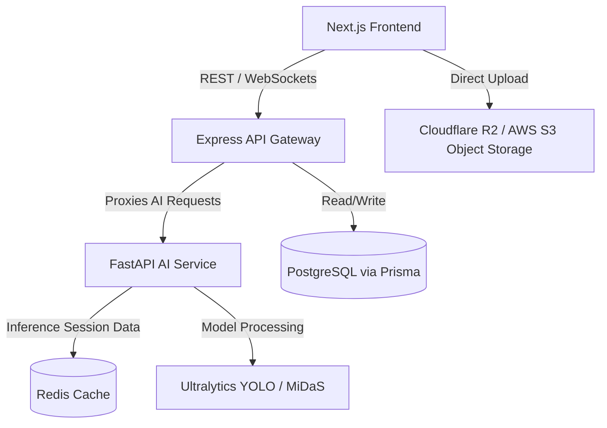
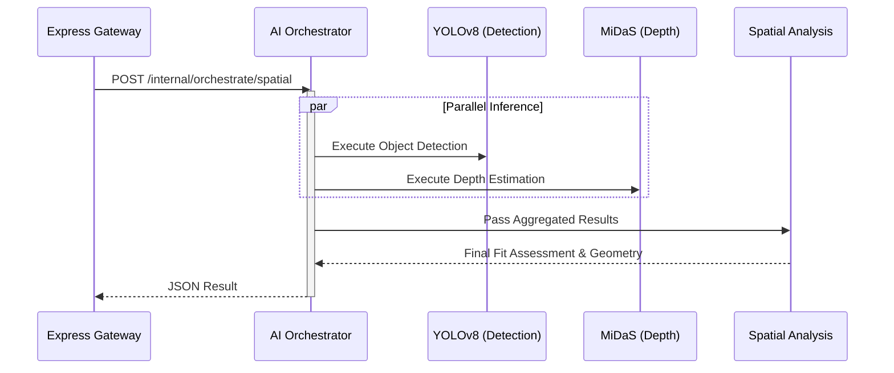

# LIMATA - Comprehensive Implementation Report

## 1. Executive Summary
This document provides a comprehensive implementation report of the LIMATA One-Click Furniture Store, detailing the system architecture, Artificial Intelligence (AI) integration, 3D/Augmented Reality (AR) implementation, and backend services. The report outlines the separation of concerns and data flows that make the platform scalable and robust.

## 2. High-Level System Architecture
LIMATA utilizes a hybrid, event-driven microservice architecture, organized as a monorepo (Turborepo + pnpm) to decouple compute-heavy ML workloads from standard web requests.



## 3. AI Implementation (FastAPI Service)
The AI ecosystem operates as an isolated, pure ML microservice (`apps/ai-service`) running PyTorch. It ensures the web gateway is never blocked by computationally expensive vision models.

### 3.1 AI Pipeline Orchestration
To achieve true separation of concerns, the AI Pipeline Orchestrator centrally manages the execution flow. Models are treated as pure functions.



### 3.2 Key AI Modules
- **Object Detection (YOLOv8)**: Detects spatial bounds, walls, and existing furniture in user-uploaded room photos.
- **Depth Estimation (MiDaS)**: Calculates monocular depth matrices to ensure furniture fits accurately within a 3D perspective.
- **Generative AI (Google GenAI)**: Powers conversational chatbots, style recommendations, and generative features.
- **Room Analysis Caching (Redis)**: Stores structural room data in Redis sessions for rapid re-evaluation. When a user tests multiple products in the same room, the system bypasses YOLO/MiDaS and routes directly to the spatial analysis module.

## 4. 3D & Augmented Reality (AR) Implementation
The frontend uses modern WebGL and WebXR standards to deliver immersive 3D and AR experiences natively in the browser (`apps/web/src/features/products/components`).

### 4.1 Technologies Used
- **React Three Fiber (R3F) & Drei**: Powers the `product-3d-viewer.tsx` for creating an interactive, performant 3D product viewer directly in the React DOM.
- **Google Model Viewer**: Powers the `ar-launcher-view.tsx`. It provides WebXR fallback and seamless transitions to native iOS (ARKit/QuickLook) and Android (Scene Viewer) for actual AR placement in a physical room.
- **glTF Pipeline**: Used in the Node.js backend to process, compress, and optimize `.glb` and `.gltf` 3D assets before serving them to the frontend.

```mermaid
flowchart LR
    A[Raw 3D Asset .glb] --> B[Express Gateway]
    B -->|glTF-pipeline compression| C(Cloudflare R2 Storage)
    C -->|Stream Assets| D[Next.js Web Frontend]
    D --> E{Client Device Check}
    E -->|Desktop / Web Only| F[React Three Fiber Canvas]
    E -->|Mobile AR Support| G[@google/model-viewer WebXR]
```

## 5. Backend & Infrastructure (Express API)
The Node.js/Express application acts as the primary gateway (`apps/api`) managing state, auth, and database interactions.

- **Database**: PostgreSQL orchestrated via Prisma ORM for products, user accounts, and e-commerce orders.
- **File Upload Strategy (Pre-signed URLs)**: To prevent Out-Of-Memory (OOM) crashes on the Node server, the frontend requests a short-lived Pre-signed Upload URL from Express. The frontend then uploads heavy image or `.glb` files directly to Cloudflare R2.
- **Real-Time Communication**: Uses `Socket.io` for asynchronous WebSockets, pushing notifications to the frontend when long-running AI pipelines complete.

## 6. Monorepo Organization
The project is strictly modularized using Turborepo to ensure fast CI/CD builds, code sharing, and clean dependency graphs.

- `apps/web`: Next.js React frontend.
- `apps/api`: Node.js Express Gateway API.
- `apps/ai-service`: Python FastAPI Machine Learning Service.
- `packages/ui`: Shared UI components tailored for LIMATA.
- `packages/config`: Shared configurations (ESLint, Prettier).
- `packages/types`: Shared TypeScript interface definitions for cross-app consistency.
