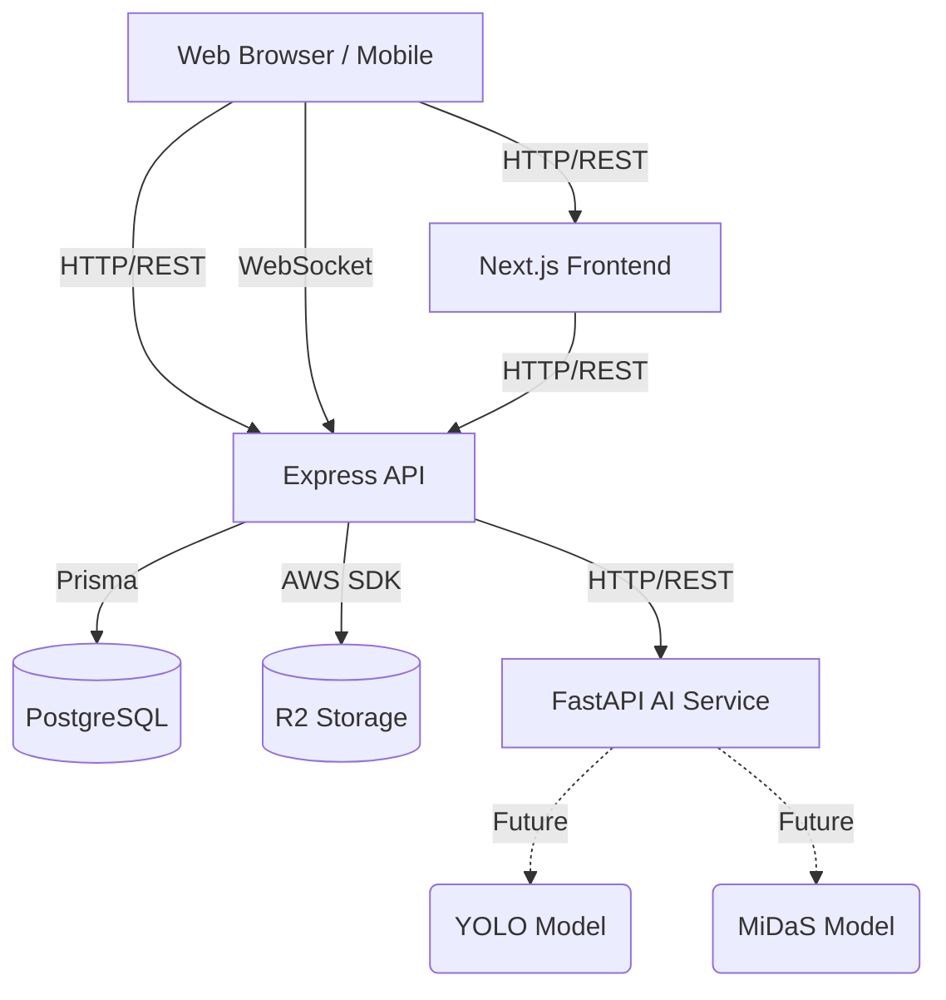
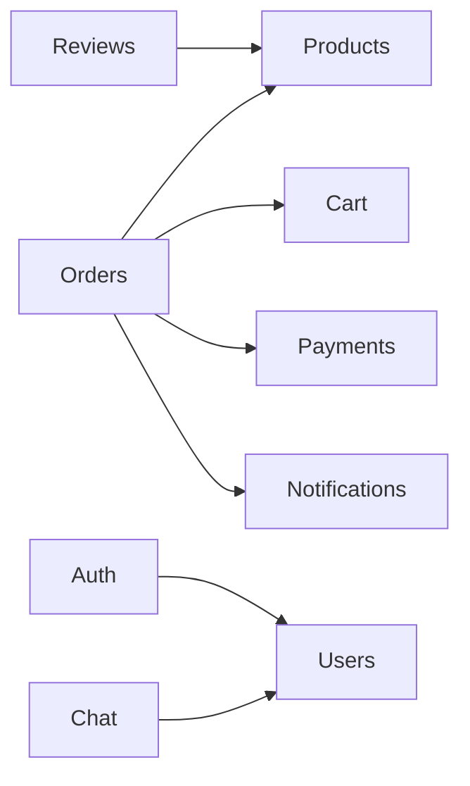

# LIMATA ARCHITECTURE AUDIT (PHASE 1 - TASK 01)

## 1. Project Overview

**Purpose:** LIMATA is an advanced e-commerce platform specializing in furniture, aimed at providing an immersive shopping experience through AR/3D product viewers, real-time chat, and an integrated admin dashboard.

**Architecture Style:** Modular Monolith transitioning to Microservices via a Monorepo.

**Tech Stack:**
- **Frontend:** Next.js (App Router), React 19, Tailwind CSS v4, Zustand, React Query, React Three Fiber (AR/3D).
- **Backend:** Node.js, Express.js, Socket.IO.
- **AI Service:** Python, FastAPI.
- **Database ORM:** Prisma.
- **Database:** PostgreSQL (Supabase).
- **Storage:** AWS S3 SDK (Cloudflare R2).
- **Payment:** PayHere.

**Monorepo Structure & Build System:**
The project uses **Turborepo** and **pnpm workspaces** to manage multiple applications (`web`, `api`, `ai-service`) and shared packages (`@limata/types`, `@limata/ui`, `@limata/config`). This allows for shared code execution, unified linting/formatting, and optimized build caching.

**Deployment Architecture (Target):**
- Frontend: Vercel (Next.js)
- Backend: Render or similar Node.js hosting
- AI Service: Render or specialized GPU instance (FastAPI)
- Database: Supabase

---

## 2. Directory & File Analysis

```text
E:\REACT_PROJECTS\LIMATA\LIMATA-ONE-CLICK-FURNITURE-STORE
├── apps/
│   ├── api/             # Express backend providing REST and WebSocket endpoints
│   ├── web/             # Next.js frontend application (Customer & Admin UI)
│   └── ai-service/      # Python/FastAPI microservice for AI features
├── packages/
│   ├── config/          # Shared ESLint/Prettier configs
│   ├── types/           # Shared TypeScript interfaces & Zod schemas
│   └── ui/              # Shared Tailwind components
├── prisma/              # Database schema & seed scripts
│   └── schema.prisma    # Centralized data model
├── package.json         # Root dependencies and workspace scripts
└── turbo.json           # Turborepo task pipeline configuration
```

### Important Files
- `apps/api/src/modules/*/index.ts`: Multiple index files acting as barrel exports, but some contain placeholder `TODO` comments for unimplemented modules (e.g., `recommendations`, `placement`).
- `apps/web/src/features/`: Contains domain-driven frontend modules encapsulating API hooks, components, and services.
- `apps/api/src/socket/socket.server.ts`: Manages real-time connections for Chat and Notifications.

---

## 3. Architecture Analysis

### Mermaid Diagrams

**General System Architecture**


**Module Dependencies (Backend)**


---

## 4. Module Audit

| Module | Purpose | Status | Notes |
|---|---|---|---|
| **Auth** | User registration, login, JWT issuance. | **Implemented** | Uses bcryptjs for hashing. |
| **Products** | Catalog management, 3D model parsing. | **Implemented** | Integrates with R2/S3. Includes `glb-optimizer.service.ts`. |
| **Orders** | Checkout logic, status updates. | **Implemented** | Contains hardcoded shipping calculation logic. |
| **Payments** | Payment processing via PayHere & COD. | **Implemented** | Implements MD5 hashing and webhook verification. |
| **Cart** | Session cart management. | **Implemented** | Synced via REST and Zustand. |
| **Wishlist** | Saving products for later. | **Implemented** | Standard CRUD. |
| **Reviews** | Customer feedback and ratings. | **Implemented** | Standard CRUD. |
| **Notifications**| In-app real-time alerts. | **Implemented** | Uses Socket.IO + REST fallback. |
| **Chat** | Real-time customer support. | **Implemented** | Uses Socket.IO. |
| **Admin** | Dashboard aggregation & store settings. | **Implemented** | Lacks advanced analytics. |
| **Recommendations**| Product suggestions. | **Placeholder** | `index.ts` contains TODOs. Unused. |
| **Placement / AR**| AR spatial analysis calculations. | **Placeholder** | Backend logic missing (`placement/index.ts` is empty/TODO). Frontend Viewer is implemented. |
| **AI Module** | Image processing, spatial detection. | **Placeholder** | Only a scaffolded `/health` route exists. |

---

## 5. System Flow Documentation

1. **Authentication Flow:** User submits credentials -> `api/auth` validates -> Issues JWT -> Frontend stores in memory/cookies -> Axios interceptor attaches `Authorization: Bearer <token>` to requests.
2. **File Upload Flow:** Admin uploads image/GLB -> Frontend multipart POST -> `api/products` (multer) -> Generates pre-signed URL/Uploads to S3/R2 -> Saves URL to DB.
3. **Payment Flow:** User checkouts -> `api/orders` calculates total -> `api/payments` generates PayHere Hash -> User redirects to PayHere -> PayHere Webhook hits `api/payments` -> Verifies MD5 -> Confirms Order & Decrements Stock -> Sends Notification.
4. **Socket.IO Flow:** User authenticates -> Socket connects and joins room based on `userId` -> Chat messages & notifications are emitted to specific rooms.

---

## 6. Implementation Status Summary

| Feature Category | Feature Name | Status |
|---|---|---|
| **Core E-commerce** | Product Listing | ✅ Implemented |
| | Cart & Checkout | ✅ Implemented |
| | Orders & Payments | ✅ Implemented |
| | User Profiles | ✅ Implemented |
| **Admin Controls** | Product Management | ✅ Implemented |
| | Order Fulfillment | ✅ Implemented |
| | Analytics | ⏳ Partially Implemented |
| **Engagement** | Real-time Chat | ✅ Implemented |
| | Wishlist & Reviews | ✅ Implemented |
| | Push Notifications | ✅ Implemented |
| **Advanced UX (AI/AR)**| 3D Model Viewer | ✅ Implemented |
| | AR Viewer (Mobile) | ✅ Implemented |
| | Recommendation Engine | ❌ Planned |
| | Spatial Analysis (AI) | ❌ Planned |
| | AI Chatbot | ❌ Planned |

---

## 7. Code Quality Audit

- **Dead Code & Placeholders:** Several folders in `apps/api/src/modules/` (e.g., `recommendations`, `placement`) only contain an `index.ts` file with `// TODO` comments.
- **Hardcoded Logic (Tech Debt):** `apps/api/src/modules/orders/order.service.ts` contains hardcoded shipping values (`subtotal < 5000` -> charge 1000). This should be migrated to the `StoreSetting` table.
- **Duplicate Logic:** The database transaction logic for checking stock and clearing carts is duplicated in `payment.service.ts` (Webhook) and `order.service.ts` (Client-side manual confirm).
- **Environment Variables:** Development environments might leak secrets if `.env` structures aren't strictly validated via Zod on backend startup.

---

## 8. AI Readiness Assessment

The current architecture is **NOT** ready to immediately support complex AI models (YOLOv8, MiDaS) without preliminary infrastructure work.

**Current State:**
- `apps/ai-service` is an empty FastAPI shell.
- No Python dependency management for ML libraries (PyTorch, OpenCV are missing).
- No Docker containerization to isolate the heavy ML environment.
- No model loading lifecycle integrated into the FastAPI app.

**Prerequisites to Complete First:**
1. **Dockerization:** Create a `Dockerfile` for `ai-service` to lock down CUDA/PyTorch system dependencies.
2. **Dependency Update:** Add `ultralytics`, `torch`, `torchvision`, `opencv-python`, and `transformers` to `requirements.txt`.
3. **Model Weight Storage Strategy:** Determine if `.pt` files will be baked into the Docker image, downloaded at runtime from S3, or mounted via volume (due to size constraints).

---

## 9. Risk Assessment & Recommendations

### Risks
1. **Scalability (High):** Socket.IO currently runs on a single Node.js instance. If scaled horizontally, a Redis adapter is required for pub/sub messaging across instances.
2. **Maintainability (Medium):** Duplicated checkout/payment logic increases the risk of race conditions or bugs if one flow is updated but the other isn't.
3. **Performance (Medium):** Loading multiple large `.glb` files on the frontend can severely impact mobile performance without proper caching or compression pipelines.

### Prioritized Recommendations

**Quick Wins (Low Effort, High Impact)**
1. Centralize the shipping calculation logic into a shared utility function.
2. Abstract the duplicated "Confirm Order & Decrement Stock" logic into a single transactional service function.

**Medium Priority**
1. Move hardcoded configuration (shipping tiers, PayHere merchant ID fallbacks) strictly into environment variables or the `StoreSetting` database table.
2. Implement Zod-based environment variable validation for both the Express and FastAPI apps to fail fast on startup.

**High Priority (Before AI Implementation)**
1. Dockerize the `apps/ai-service` to ensure consistent ML environments across developer machines.
2. Implement a Redis Adapter for Socket.IO if targeting serverless or multi-instance deployment.
