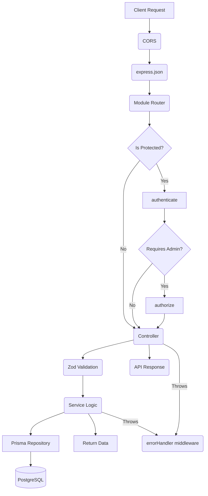

# LIMATA BACKEND AUDIT (PHASE 1 - TASK 02)

## 1. Scope & Execution

This document provides a complete read-only audit of the **LIMATA backend application** located at `apps/api`. The analysis covers the module structure, API endpoints, architecture, database usage, dependencies, and code quality based entirely on the existing codebase.

---

## 2. Architecture Analysis

### Application Startup & Request Lifecycle

1. **Bootstrap:** `index.ts` loads environment variables via `load-env.ts` and imports `server.ts`.
2. **Server Creation:** `server.ts` wraps the Express app (`app.ts`) into a Node `http.createServer` and initializes Socket.IO (`socket.server.ts`).
3. **Global Middleware:** `app.ts` registers global middlewares:
   - `cors`: Parsed dynamically from `process.env.FRONTEND_URL`.
   - `express.json`: Body parsing.
   - `express.static`: Serves local `/uploads` files.
4. **Routing:** Request hits module-specific routers (e.g., `/api/products`).
5. **Middleware Pipeline:** Route-specific middlewares execute (e.g., `authenticate`, `authorize(Role.ADMIN)`).
6. **Controller -> Service -> Repository:** Business logic is isolated in services, database interactions in repositories.
7. **Error Handling:** Synchronous and asynchronous errors are caught by `errorHandler.ts` using `ApiError` class instances, ensuring a uniform JSON error response.

### Mermaid Diagram: Request Pipeline

---

## 3. Module Audit

### 1. Auth Module (`apps/api/src/modules/auth`)
- **Purpose:** Handles user registration, login, and profile management.
- **Status:** ✅ Implemented
- **Components:** Controller, Service, Repository, Route, Validation (Zod).
- **Security:** Uses `bcryptjs` for password hashing, `jsonwebtoken` for issuing stateless access tokens.
- **Tech Debt/Risks:** Standard JWT architecture. Missing robust refresh-token rotation logic. 

### 2. Products Module (`apps/api/src/modules/products`)
- **Purpose:** Catalog management, product querying, and 3D Model handling.
- **Status:** ✅ Implemented
- **Components:** Includes `glb-optimizer.service.ts` for handling 3D models.
- **DB Interactions:** CRUD on `Product` model.
- **Tech Debt:** Fetching products without pagination could be a bottleneck if catalog size increases.

### 3. Orders Module (`apps/api/src/modules/orders`)
- **Purpose:** Manages checkout flow, COD vs PayHere divergence, order statuses.
- **Status:** ✅ Implemented
- **Business Logic:** Dynamically calculates shipping based on subtotal limits (`< 5000` = `1000` LKR). 
- **Tech Debt/Risks:** Hardcoded shipping values. Logic for stock decrement is duplicated between PayHere webhook and client-side confirmation.

### 4. Payments Module (`apps/api/src/modules/payments`)
- **Purpose:** Handles PayHere integration and webhooks.
- **Status:** ✅ Implemented
- **Security:** Verifies `md5sig` from PayHere webhooks to prevent spoofed payment confirmations.
- **DB Interactions:** `$transaction` used for stock decrements and cart clearing on success.

### 5. Chat Module (`apps/api/src/modules/chat`)
- **Purpose:** Stores and retrieves historical chat conversations between customers and admins.
- **Status:** ✅ Implemented
- **Dependencies:** Heavily integrated with `socket.server.ts` for real-time delivery. 

### 6. Admin Module (`apps/api/src/modules/admin`)
- **Purpose:** Aggregates dashboard statistics and manages users/categories.
- **Status:** ✅ Implemented
- **DB Interactions:** Heavy aggregation queries (`count`, `sum`) on Orders, Users, Products.

### 7. Recommendations & Placement (`apps/api/src/modules/recommendations`, `placement`)
- **Purpose:** ML-driven product suggestions and AR spatial backend calculations.
- **Status:** ❌ Placeholder
- **Tech Debt:** Folders exist with only an `index.ts` file containing `TODO` comments.

---

## 4. API Inventory

| Method | Route | Auth Required | Module | Status |
|---|---|---|---|---|
| **GET** | `/api/v1/health` | No | Health | ✅ |
| **POST** | `/api/auth/register` | No | Auth | ✅ |
| **POST** | `/api/auth/login` | No | Auth | ✅ |
| **GET** | `/api/auth/profile` | Yes | Auth | ✅ |
| **GET** | `/api/products` | No | Products | ✅ |
| **GET** | `/api/products/:productId` | No | Products | ✅ |
| **POST** | `/api/products` | Yes (Admin) | Products | ✅ |
| **POST** | `/api/orders` | Yes | Orders | ✅ |
| **GET** | `/api/orders/:orderId` | Yes | Orders | ✅ |
| **POST** | `/api/payment/notify` | No (Webhook) | Payments | ✅ |
| **GET** | `/api/cart` | Yes | Cart | ✅ |
| **GET** | `/api/wishlist` | Yes | Wishlist | ✅ |
| **GET** | `/api/admin/stats` | Yes (Admin) | Admin | ✅ |
| **GET** | `/api/chat/conversations` | Yes | Chat | ✅ |
| **GET** | `/api/notifications` | Yes | Notifications | ✅ |

*(Note: Additional CRUD routes for Cart Items, Reviews, Admin actions exist and map standard REST paradigms).*

---

## 5. Database Usage & Dependency Analysis

- **Prisma Integration:** Centralized via `lib/prisma.ts` which exports a singleton client to avoid exhausting connection pools.
- **Transactions:** Successfully used in `payment.service.ts` and `order.service.ts` to ensure Cart deletion, Stock decrement, and Order status updates are atomic.
- **Module Coupling:** The `Payments` and `Orders` modules are tightly coupled, as the payment webhook imports order repositories to verify order existence. `Chat` is tightly coupled to `Sockets`.

---

## 6. Security Audit

- **JWT:** Access tokens are issued, but there is no explicit refresh token mechanism found, which forces users to re-login once the token expires.
- **Password Hashing:** `bcryptjs` is correctly utilized.
- **RBAC:** `authorize.ts` middleware correctly enforces Role constraints (e.g., `Role.ADMIN`).
- **File Validation:** `multer` handles file streams, though extensive validation on `.glb` payload integrity inside `glb-optimizer.service.ts` should be closely monitored.
- **CORS:** Securely parses `FRONTEND_URL` environment string into an allowed origin array.

---

## 7. Performance & Code Quality Audit

### Code Smells & Tech Debt
1. **Hardcoded Business Logic:** The shipping tiers in `order.service.ts` (e.g., `if (subtotal < 5000) standardCharge = 1000;`) are a code smell. They should be moved to the `StoreSetting` database schema.
2. **Duplicated Logic:** `payment.service.ts` (webhook) and `order.service.ts` (`confirmPayherePaymentClientSide`) share near-identical 30-line transaction blocks for finalizing checkouts. This violates DRY.
3. **Empty Modules:** `recommendations` and `placement` modules exist purely as scaffolds with `TODO` markers.

### Performance Risks
1. **N+1 Query Risks:** Some `findMany` calls in admin statistics might trigger slow aggregations if not indexed properly as the database grows.
2. **WebSockets:** Currently relies on memory state in `socket.server.ts`. If the Node.js process restarts, active connections drop. Horizontal scaling is impossible without adding a `socket.io-redis` adapter.

---

## 8. Implementation Summary

| Module | Status | Completion | Issues | Priority |
|---|---|---|---|---|
| Auth | Implemented | 100% | Lack of refresh token rotation | Low |
| Products | Implemented | 100% | No pagination limits enforced | Medium |
| Orders | Implemented | 100% | Hardcoded shipping rules | High |
| Payments | Implemented | 100% | Duplicated finalization logic | Medium |
| Chat / Socket | Implemented | 100% | Not horizontally scalable (No Redis) | High |
| Admin | Implemented | 90% | Missing heavy aggregation charts | Low |
| Recommendations | Placeholder | 0% | Entirely missing | High |
| Placement (AR) | Placeholder | 0% | Backend calculations missing | Medium |

---

## 9. Final Assessment

**Backend Maturity:** The LIMATA backend is a functional, modern Express.js API. It successfully implements the core features required for e-commerce (Auth, Products, Cart, Orders, Payments via PayHere). 

**Production Readiness:** The backend is ready for a soft-launch but requires remediation of the hardcoded shipping rules and duplicated payment logic before scaling. If multiple server instances are required, the Socket.IO setup must be retrofitted with Redis.

**AI Integration Readiness:** ❌ The Express backend has no current linkage to the `ai-service` FastAPI app. The `recommendations` and `placement` folders are empty. The backend requires internal HTTP clients (e.g., `axios`) to securely relay spatial calculation requests to the Python microservice.

### Quick Wins (Refactoring)
1. Consolidate the "Cart Deletion + Stock Decrement" logic into a single shared utility function called by both COD and PayHere pipelines.
2. Expose an Admin route to modify `StoreSetting` keys specifically for "Shipping Minimums", replacing the hardcoded limits in `order.service.ts`.
