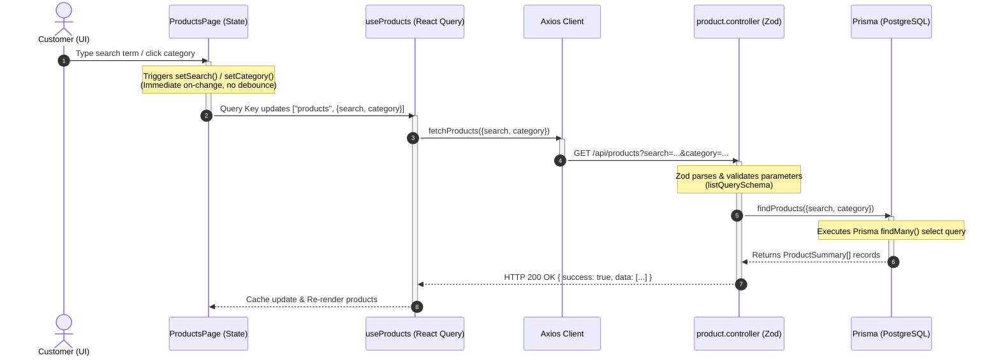

# Product Search & Filtering Feature Analysis

This document provides a comprehensive technical analysis of the Product Search & Filtering implementation in the **LIMATA** codebase. It outlines the frontend interface, the API request lifecycle, the database query structure, and highlights differences from standard production proposals.

---

## 1. Related File Paths

### Frontend (Next.js Web App)

- **Product Listing Page**: [page.tsx](file:///e:/REACT_PROJECTS/LIMATA/LIMATA-One-Click-Furniture-Store/apps/web/src/app/products/page.tsx) — Entry point page that coordinates search, filter, and list states.
- **Search Input Component**: [product-search.tsx](file:///e:/REACT_PROJECTS/LIMATA/LIMATA-One-Click-Furniture-Store/apps/web/src/features/products/components/product-search.tsx) — Render search input box and emits input changes.
- **Category Filter Component**: [category-filter.tsx](file:///e:/REACT_PROJECTS/LIMATA/LIMATA-One-Click-Furniture-Store/apps/web/src/features/products/components/category-filter.tsx) — Displays buttons for product category selection.
- **Product Grid Component**: [product-grid.tsx](file:///e:/REACT_PROJECTS/LIMATA/LIMATA-One-Click-Furniture-Store/apps/web/src/features/products/components/product-grid.tsx) — Displays list of matching cards.
- **Product Card Component**: [product-card.tsx](file:///e:/REACT_PROJECTS/LIMATA/LIMATA-One-Click-Furniture-Store/apps/web/src/features/products/components/product-card.tsx) — Renders individual product visual summary.
- **Products Query Hook**: [use-products.tsx](file:///e:/REACT_PROJECTS/LIMATA/LIMATA-One-Click-Furniture-Store/apps/web/src/features/products/hooks/use-products.tsx) — TanStack React Query hook for data fetching.
- **Products Service**: [product.service.ts](file:///e:/REACT_PROJECTS/LIMATA/LIMATA-One-Click-Furniture-Store/apps/web/src/features/products/services/product.service.ts) — Axios client endpoints wrapper.
- **Types Definition**: [product.types.ts](file:///e:/REACT_PROJECTS/LIMATA/LIMATA-One-Click-Furniture-Store/apps/web/src/features/products/types/product.types.ts) — Product structure models.

### Backend (Express API Service)

- **Products Router**: [product.route.ts](file:///e:/REACT_PROJECTS/LIMATA/LIMATA-One-Click-Furniture-Store/apps/api/src/modules/products/product.route.ts) — Registers GET endpoints.
- **Products Controller**: [product.controller.ts](file:///e:/REACT_PROJECTS/LIMATA/LIMATA-One-Click-Furniture-Store/apps/api/src/modules/products/product.controller.ts) — Handles HTTP request parsing, Zod validation, and response formatting.
- **Validation Schema**: [product.validation.ts](file:///e:/REACT_PROJECTS/LIMATA/LIMATA-One-Click-Furniture-Store/apps/api/src/modules/products/product.validation.ts) — Zod validation model for query parameters.
- **Products Service**: [product.service.ts](file:///e:/REACT_PROJECTS/LIMATA/LIMATA-One-Click-Furniture-Store/apps/api/src/modules/products/product.service.ts) — Orchestrates business logic.
- **Products Repository**: [product.repository.ts](file:///e:/REACT_PROJECTS/LIMATA/LIMATA-One-Click-Furniture-Store/apps/api/src/modules/products/product.repository.ts) — Queries database via Prisma client.

### Database Layer

- **Prisma Schema**: [schema.prisma](file:///e:/REACT_PROJECTS/LIMATA/LIMATA-One-Click-Furniture-Store/prisma/schema.prisma) — Database layout schema.

---

## 2. Data Flow (UI → API → DB)

When a user interacts with the search field or category filters on the frontend, the application behaves as follows:



---

## 3. Detailed Logic Analysis

### A. Search Logic

1. **Frontend**:
   - Located in [product-search.tsx](file:///e:/REACT_PROJECTS/LIMATA/LIMATA-One-Click-Furniture-Store/apps/web/src/features/products/components/product-search.tsx).
   - Simple text input field of type `search`.
   - **Key Behavior**: The standard HTML `onChange` handler directly emits the search query to the parent component page:
     ```tsx
     onChange={(e) => onSearch(e.target.value)}
     ```
   - There is **no debouncing** implemented on the frontend. Every key typed triggers a new state update and an immediate API network request.
2. **Backend**:
   - Handled inside [product.repository.ts](file:///e:/REACT_PROJECTS/LIMATA/LIMATA-One-Click-Furniture-Store/apps/api/src/modules/products/product.repository.ts).
   - Substring search is built using Prisma's `contains` operator with the case-insensitive mode set (`mode: "insensitive"`):
     ```typescript
     if (search) {
       where.name = { contains: search, mode: "insensitive" };
     }
     ```
   - This retrieves records where the product name contains the target search substring (similar to SQL `%search%` operator).

### B. Filter Logic

1. **Frontend**:
   - Located in [category-filter.tsx](file:///e:/REACT_PROJECTS/LIMATA/LIMATA-One-Click-Furniture-Store/apps/web/src/features/products/components/category-filter.tsx).
   - **Key Behavior**: The category buttons list is hardcoded on the client-side:
     ```typescript
     const options = [
       "All",
       "Living Room",
       "Bedroom",
       "Dining Room",
       "Office",
       "Storage",
     ];
     ```
   - Clicking a button updates the selected button visual style and triggers `onSelect(cat === "All" ? undefined : cat)`.
2. **Backend**:
   - Uses Prisma's exact string equality comparison for category filtering:
     ```typescript
     if (category) {
       where.category = category;
     }
     ```
   - Categories must match process strings stored in the `category` column (e.g. `'Living Room'`).

---

## 4. APIs & Endpoints Used

### Endpoint Details

- **Method**: `GET`
- **Path**: `/api/products` (Prefix depends on setup, standard routing resolves to `/products` inside [product.route.ts](file:///e:/REACT_PROJECTS/LIMATA/LIMATA-One-Click-Furniture-Store/apps/api/src/modules/products/product.route.ts))
- **Headers**: `Content-Type: application/json`
- **Authentication**: None (Public Endpoint)
- **Query Parameters**:
  - `search` (Optional String): Search keyword matching product `name`.
  - `category` (Optional String): Category string filter (exact match).

### Validation Schema (Zod)

In [product.validation.ts](file:///e:/REACT_PROJECTS/LIMATA/LIMATA-One-Click-Furniture-Store/apps/api/src/modules/products/product.validation.ts):

```typescript
export const listQuerySchema = z.object({
  search: z.string().optional(),
  category: z.string().optional(),
});
```

### Sample API Response

```json
{
  "success": true,
  "message": "ok",
  "data": [
    {
      "id": "clxb12345abcd",
      "name": "Modern Fabric Sofa",
      "price": 45000,
      "category": "Living Room",
      "images": ["https://r2.limata-store.com/products/images/modern-sofa.png"],
      "stock": 10
    }
  ]
}
```

---

## 5. Database Queries & Schema

### Database Table Schema

In [schema.prisma](file:///e:/REACT_PROJECTS/LIMATA/LIMATA-One-Click-Furniture-Store/prisma/schema.prisma):

```prisma
model Product {
  id          String   @id @default(cuid())
  name        String
  description String
  price       Float
  stock       Int
  category    String
  material    String?
  images      String[]
  model3dUrl  String?
  createdAt   DateTime @default(now())
  updatedAt   DateTime @updatedAt
  cartItems   CartItem[]
}
```

### Prisma Query

```typescript
const products = await prisma.product.findMany({
  where: {
    name: search ? { contains: search, mode: "insensitive" } : undefined,
    category: category ? category : undefined,
  },
  select: {
    id: true,
    name: true,
    price: true,
    category: true,
    images: true,
    stock: true,
  },
  orderBy: { createdAt: "desc" },
});
```

### Generated SQL Query (PostgreSQL Equivalent)

Assuming a search query of `?search=sofa&category=Living Room`, the underlying SQL query generated is equivalent to:

```sql
SELECT
  "id",
  "name",
  "price",
  "category",
  "images",
  "stock"
FROM "public"."Product"
WHERE (
  "name" ILIKE '%sofa%'
  AND "category" = 'Living Room'
)
ORDER BY "createdAt" DESC;
```

---

## 6. Key Code Snippets

### Frontend API Hook ([use-products.tsx](file:///e:/REACT_PROJECTS/LIMATA/LIMATA-One-Click-Furniture-Store/apps/web/src/features/products/hooks/use-products.tsx))

```typescript
export function useProducts(search?: string, category?: string) {
  return useQuery<ProductSummary[], Error>({
    queryKey: ["products", { search, category }],
    queryFn: () => fetchProducts({ search, category }),
  });
}
```

### Frontend Services Call ([product.service.ts](file:///e:/REACT_PROJECTS/LIMATA/LIMATA-One-Click-Furniture-Store/apps/web/src/features/products/services/product.service.ts))

```typescript
export async function fetchProducts(params?: {
  search?: string;
  category?: string;
}) {
  const res = await api.get<ApiResponse<ProductSummary[]>>("/products", {
    params,
  });
  return res.data.data;
}
```

### Backend Repository Query Builder ([product.repository.ts](file:///e:/REACT_PROJECTS/LIMATA/LIMATA-One-Click-Furniture-Store/apps/api/src/modules/products/product.repository.ts))

```typescript
export async function findProducts(opts: {
  search?: string;
  category?: string;
}) {
  const { search, category } = opts;
  const where: Record<string, unknown> = {};

  if (search) {
    where.name = { contains: search, mode: "insensitive" };
  }
  if (category) {
    where.category = category;
  }

  const products = await prisma.product.findMany({
    where,
    select: {
      id: true,
      name: true,
      price: true,
      category: true,
      images: true,
      stock: true,
    },
    orderBy: { createdAt: "desc" },
  });

  return products as Array<
    Pick<Product, "id" | "name" | "price" | "category" | "images" | "stock">
  >;
}
```

---

## 7. Differences from Proposal & Standard Architectures

An analysis of the current product search and filter feature reveals several deviations from industry-standard requirements:

| Aspect                       | Current Implementation                                            | Standard Proposal Expectation                                                                                         | Impact                                                                                               |
| ---------------------------- | ----------------------------------------------------------------- | --------------------------------------------------------------------------------------------------------------------- | ---------------------------------------------------------------------------------------------------- |
| **Search Debouncing**        | None. Keyup events instantly call the API.                        | Debounced input query (e.g. `300ms` window).                                                                          | High rate of API requests, leading to server load and database query spamming under fast typing.     |
| **Category Synchronization** | Hardcoded array on the client side: `["All", "Living Room", ...]` | Fetched dynamically via dedicated route `GET /api/products/categories` or generated from active database values.      | Adding categories to the DB schema doesn't render them in the filter until frontend code is updated. |
| **Database Indices**         | None on key filter columns in Prisma Schema.                      | Indices (`@@index([category])`, or Trgm/GIN index for name search).                                                   | Slow table scans on product catalogs larger than several thousand rows.                              |
| **Search Scope**             | Search matches ONLY the product `name`.                           | Matches both product `name` and `description` (using PostgreSQL full-text search `tsvector`/`tsquery`).               | Narrow search capability; typing a word from descriptions returns zero results.                      |
| **Pagination**               | None. Requests load all matched products at once.                 | Cursor-based (`skip`/`take`) pagination or Infinite Scrolling on the grid.                                            | High latency, potential UI lockup, and memory overhead when the product catalog grows.               |
| **Sorting**                  | Fixed order `createdAt: "desc"` in backend code.                  | Dynamic sorting options (e.g. `price_asc`, `price_desc`, `popularity`, `name`).                                       | Customers cannot view cheapest items first or sorting options.                                       |
| **Filter Options**           | Category exact match only.                                        | Multiple choice category selection (checkboxes), Price ranges (min/max), Materials, and Availability (in-stock only). | Restricted product filtering, poor UX compared to standard e-commerce shops.                         |
