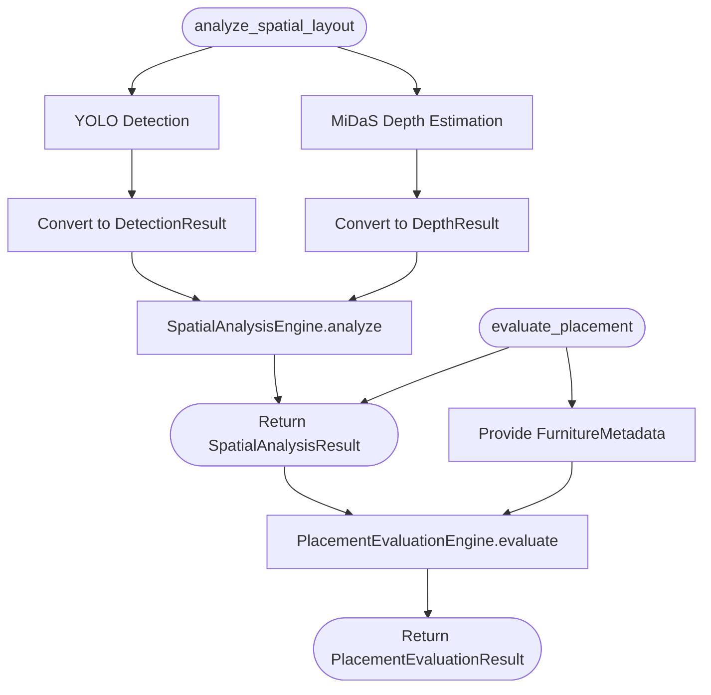

# LIMATA AI Architecture

This document serves as the authoritative design reference for the AI subsystem within the LIMATA backend.

## 1. AI Subsystem Overview
The AI subsystem is responsible for executing deep learning models (currently YOLO for object detection and MiDaS for depth estimation) safely and efficiently within the application. It acts as an isolated microservice module, ensuring that third-party ML frameworks (like Ultralytics or PyTorch) never leak into the broader LIMATA application logic. 

Furthermore, the subsystem performs deterministic spatial reasoning over the probabilistic outputs of the AI models. **AI models perform perception, while the SpatialAnalysisEngine performs deterministic reasoning.**

## 2. Updated Folder Structure
```text
apps/ai-service/
├── app/
│   ├── core/
│   │   └── exceptions.py          # Core application exceptions
│   ├── ml/
│   │   ├── ai_orchestrator.py     # Coordinates the pipeline
│   │   ├── bounding_box.py        # DTO for bounding boxes
│   │   ├── constants.py           # Model string identifiers
│   │   ├── converters.py          # YOLO & MiDaS output parsers
│   │   ├── depth_result.py        # DTO for depth maps
│   │   ├── detected_object.py     # DTO for a single detection
│   │   ├── detection_result.py    # DTO for aggregated detection results
│   │   ├── exceptions.py          # AI exception hierarchy
│   │   ├── model_loader.py        # Lifecycle and memory management
│   │   ├── registry.py            # Catalog of available models
│   │   ├── metadata.py            # Model configuration
│   │   ├── spatial/               # Deterministic spatial reasoning foundation
│   │   │   ├── distance.py
│   │   │   ├── engine.py
│   │   │   ├── geometry.py
│   │   │   └── result.py
│   │   └── placement/             # Placement Evaluation Engine
│   │       ├── constraints.py
│   │       ├── engine.py
│   │       ├── evaluator.py
│   │       ├── geometry.py
│   │       └── result.py
├── tests/
│   └── ml/
│       ├── test_converters.py     # Unit tests for parsing
│       ├── test_loader.py         # Unit tests for loading/state
│       ├── test_models.py         # Unit tests for DTOs
│       ├── test_orchestrator.py   # Unit tests for execution flow
│       ├── test_spatial_unit.py   # Unit tests for spatial geometry
│       ├── test_spatial_integration.py # E2E tests for spatial pipeline
│       ├── test_placement_unit.py # Unit tests for placement constraints
│       ├── test_placement_integration.py # E2E tests for placement pipeline
└── docs/
    ├── architecture.md            # This document
    ├── implementation_snapshot_p4a.md # Snapshot of Phase 4A
    └── implementation_snapshot_p4b.md # Snapshot of Phase 4B
```

## 3. Pipeline Responsibilities
- **YOLO**: Responsible for identifying objects within an image. Produces raw probabilistic bounding boxes and confidence scores.
- **MiDaS**: Responsible for estimating relative scene depth. Produces a raw probabilistic inverse depth map (disparity map).
- **Converter**: The strictly isolated boundary where messy third-party tensors (Ultralytics results, PyTorch tensors) are parsed and converted into clean python DTOs (`DetectionResult`, `DepthResult`).
- **SpatialAnalysisEngine**: Responsible for deterministic reasoning using `DetectionResult` and `DepthResult`. It applies rigorous geometric and statistical algorithms (e.g., extracting median depth from bounding box intersections).
- **PlacementEvaluationEngine**: Responsible for determining if a selected furniture item can be accommodated based strictly on the deterministic `SpatialAnalysisResult` and `FurnitureMetadata`. Applies heuristic checks (Congestion Index, Placement Region evaluation).
- **SpatialAnalysisResult & PlacementEvaluationResult**: Represent the final, framework-agnostic spatial understanding and evaluation of the scene.

## 4. Component Responsibilities
- **ModelRegistry**: A centralized catalog of known models and their metadata. It knows *what* models exist but doesn't load them.
- **ModelLoader**: Owns the lifecycle of AI models in memory. It enforces lazy loading, handles concurrent requests safely using thread locks, and reports the `RuntimeStatus` (e.g., `LOADING`, `READY`).
- **AIOrchestrator**: Coordinates the business logic of AI pipelines. It requests models from the loader, executes perception via YOLO and MiDaS, hands the outputs to the `SpatialAnalysisEngine`, and conditionally feeds the result to the `PlacementEvaluationEngine`.
- **DetectionResult / DepthResult / SpatialAnalysisResult / PlacementEvaluationResult**: Immutable Data Transfer Objects (DTOs) that safely carry results back to the broader application.
- **Exception Layer**: Custom exception classes ensuring that the application can gracefully handle AI failures without crashing globally on unexpected third-party library errors.

## 5. Coordinate System Convention
All spatial reasoning within the AI subsystem strictly adheres to the following image coordinate system:
- **Origin (0,0)**: Top-left corner of the image.
- **X-axis**: Increases positively from left to right.
- **Y-axis**: Increases positively from top to bottom.
- **Bounding Box Reference**: (x1, y1) specifies the top-left coordinate, while (x2, y2) specifies the bottom-right coordinate.
- **Depth Convention**: Sourced from MiDaS, which produces inverse depth (disparity). A **larger depth value** indicates the object is **closer** (less distant) to the camera.

## 6. Runtime Flow (Spatial Layout & Placement Pipeline)


## 7. Dependency Graph
Dependencies flow inwards towards pure Python abstractions.
```text
Controller --> AIOrchestrator
AIOrchestrator --> ModelLoader
AIOrchestrator --> Converters
AIOrchestrator --> SpatialAnalysisEngine
AIOrchestrator --> Constants / Exceptions
ModelLoader --> ModelRegistry
Converters --> DetectionResult / DepthResult
SpatialAnalysisEngine --> SpatialAnalysisResult / ObjectDistance
```

## 8. Exception Hierarchy
```text
Exception
 └── AIException (Base for AI module)
      ├── ModelLoadException (Disk I/O, missing weights, corrupted files)
      ├── AIInferenceException (GPU OOM, invalid image shapes)
      └── UnsupportedModelException (Requested model string is not recognized)
```

## 9. Current Implementation Status
The foundational detection, depth, and spatial reasoning pipelines are complete and heavily unit-tested. The architecture enforces lazy-loading, thread-safety, clear exception handling, robust type abstraction, and strict separation between probabilistic perception and deterministic reasoning.
